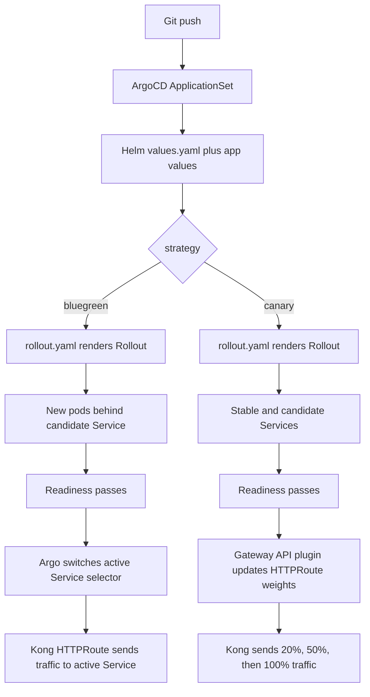

# GitOps Repo — ArgoCD Deployments

This repository is what **ArgoCD watches** to deploy applications. Everything
under it is declarative: the cluster is always an exact render of what's here,
and a `git push` triggers an ArgoCD auto-sync (GitOps).

> Set up through the parent walkthrough: `../README.md`. This file documents the
> repo itself — how it's organized and how to add a new app/strategy.

---

## How it fits together (app-of-apps)

```
gitops/
├── argocd/                      ← BOOTSTRAP (one-time, applied by an admin)
│   ├── parents/                 ← root Applications (the "app of apps")
│   │   ├── dev-environment.yaml
│   │   └── prod-environment.yaml
│   ├── dev/
│   │   ├── dev-project.yaml     ← AppProject: what this project may touch
│   │   └── dev-appset.yaml      ← ApplicationSet: generates child apps
│   └── prod/
│       ├── prod-project.yaml
│       └── prod-appset.yaml
├── helm/                        ← SHARED chart (generic-microservice)
│   ├── Chart.yaml
│   ├── values.yaml              ← base defaults for every app
│   └── templates/               ← Deployment / Rollout / Service / HTTPRoute …
└── applications/                ← PER‑APP overrides
    ├── dev/<app>-values.yaml
    └── prod/<app>-values.yaml
```

1. **Parent** (`argocd/parents/*.yaml`) points at `argocd/<env>/` → creates the
   `AppProject` + `ApplicationSet`.
2. **ApplicationSet** generates **one child Application per app** (from its
   `list` of app names) using the shared `helm/` chart.
3. Each child Application feeds the chart **`helm/values.yaml` + the app's own
   `applications/<env>/<app>-values.yaml`**, merges them (app wins), and syncs
   the rendered manifests into its namespace.

```
push to gitops → ArgoCD (child app) → helm render (base + app values)
             → apply Deployment/Rollout + Service + HTTPRoute → pods
```

---

## Onboarding a new app (e.g. `my-app`)

Add it to **both** ApplicationSets, then push:

```yaml
# argocd/dev/dev-appset.yaml   (and prod/prod-appset.yaml)
generators:
  - list:
      elements:
        - app: python-demo-for-dashboard   # existing
        - app: my-app                      # ← add this
```

Create its per-env values files:

```yaml
# applications/dev/my-app-values.yaml
image:
  repository: <ECR repo URL>
  tag: <git-sha>
replicaCount: 2
route:
  enabled: true
  host: my-app-dev.tyagi.fun
probes:
  enabled: true
  liveness: { path: /health }
  readiness: { path: /health }
```

**Commit → push → ArgoCD auto-syncs.** Then expose it: add a Kong route +
DNS CNAME (see parent `README.md` §"Adding a new app").

---

## Choosing a rollout strategy

`helm/values.yaml` ships a flag that switches how pods are updated:

| `strategy`        | What happens                                         |
|-------------------|------------------------------------------------------|
| `""` (default)    | plain Kubernetes `Deployment` (in-place, rolling)    |
| `bluegreen`       | Argo Rollouts — active + preview ReplicaSets, flip on promote |
| `canary`          | Argo Rollouts + Kong HTTPRoute weighted traffic split |

Set it in an app's values file:

```yaml
# applications/dev/my-app-values.yaml
strategy: bluegreen
blueGreen:
  autoPromotionEnabled: true
  scaleDownDelaySeconds: 60
```

For a Kong traffic canary, configure the app like this:

```yaml
strategy: canary
replicaCount: 3
canary:
  steps:
    - setWeight: 20
    - pause:
        duration: 30s
    - setWeight: 50
    - pause:
        duration: 30s
    - setWeight: 100
```

`setWeight: 20` asks the Argo Rollouts Gateway API plugin to update the
Kong-managed `HTTPRoute` so approximately 20% of new requests use the
canary Service. The pause is an observation window; it does not itself shift
traffic. Install and configure the Gateway API traffic plugin in the Rollouts
controller before using this mode. Kong's Gateway API support alone is not
enough.

The chart creates `-service` (stable) and `-candidate-service` (candidate), and the
HTTPRoute contains both backends. Argo Rollouts manages their selectors and
updates their weights during the rollout. Keep readiness probes enabled and
use immutable image tags.

The same `-candidate-service` is used by both strategies. In blue-green it is
the private preview backend; in canary it is the weighted canary backend. The
Rollout field remains `previewService` for blue-green because that is the
official Argo Rollouts field name.

The chart deliberately keeps health checks simple: Kubernetes readiness probes
decide when new pods can receive traffic. No `AnalysisTemplate` is required.

### Python demo values files

The ApplicationSet currently loads this file:

```text
applications/dev/python-demo-for-dashboard-values.yaml
```

Two complete alternatives are provided:

```text
applications/dev/python-demo-for-dashboard-bluegreen-values.yaml
applications/dev/python-demo-for-dashboard-canary-values.yaml
```

Copy the desired alternative over the active `*-values.yaml` file, commit, and
push. ArgoCD then syncs the selected strategy. Do not load both alternatives
for the same app, because the ApplicationSet currently has one values-file
slot for this app.

### End-to-end flow



Template responsibilities:

```text
rollout.yaml       -> Rollout, pod template, blue-green/canary strategy
service.yaml       -> stable or active Service
candidate-service.yaml -> blue-green preview or canary backend Service
httproute.yaml     -> Kong public route and canary backend weights
probes             -> decides when new pods are Ready
```

`pause.duration` only waits before the next canary step. It does not detect
HTTP errors or automatically roll back. Automatic rollback requires adding an
Argo Rollouts `AnalysisTemplate` and a metrics provider such as Prometheus.

When a `strategy` is set, the chart renders `kind: Rollout`
(`argoproj.io/v1alpha1`) instead of a Deployment, plus a `-candidate-service`
for smoke-testing the new version. The **Argo Rollouts controller** (installed
in the cluster) owns the rollout. Kong continues to expose the active Service;
for canary, the Gateway API plugin also updates the HTTPRoute weights.

- Verify: `kubectl get rollout -n <ns>` → `kubectl argo rollouts get rollout <name> -n <ns>`
- During a blue‑green update you temporarily run `2× replicas` (active + preview);
  the old set scales down after `scaleDownDelaySeconds`.

---

## Key files map

| Path | Purpose |
|------|---------|
| `argocd/parents/dev-environment.yaml` | Root app: syncs `argocd/dev` into the cluster |
| `argocd/dev/dev-project.yaml` | RBAC project (which namespaces/sources are allowed) |
| `argocd/dev/dev-appset.yaml` | Generates one child app per listed app name |
| `helm/values.yaml` | Base chart defaults (image, probes, route, strategy …) |
| `helm/templates/rollout.yaml` | Blue-green and Kong-routed canary Rollout |
| `helm/templates/candidate-service.yaml` | New-version Service for blue-green or canary |
| `helm/templates/hpa.yaml` | Scales the Deployment **or** the Rollout (conditional) |
| `applications/dev/python-demo-for-dashboard-values.yaml` | Worked example of a real app's values |